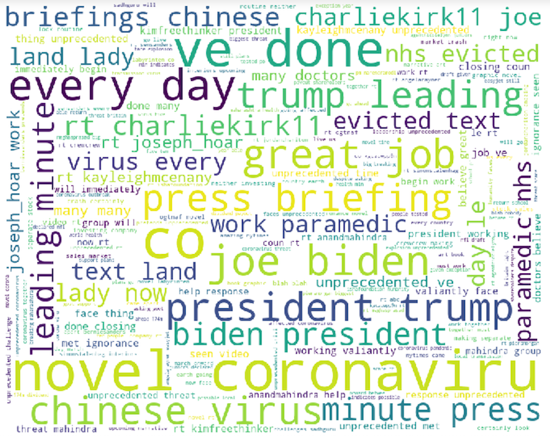

# Coronavirus: What can Tweet location tell us about the state of the virus?
My goal is to use supervised machine learning to determine if the contents of a tweet about coronavirus tells us anything about the location of the user. If so, can a model show the spread of coronavirus based on the volume and contents of people's tweets?

I've used Python to pipeline live tweets about COVID-19/Coronavirus into a MySQL database. It contains two tables: one capturing tweets featuring keywords "coronavirus" and "COVID-19", and the other capturing keywords "novel" and "unprecedented." Collected information includes username, tweet text, tweet location as reported by user, and date and time of tweet.

After 48 hours of open pipeline, more than 10 million tweets were captured in the first category. After 36 hours, about 5.7 million tweets were captured in the second. I've closed the pipelines while I do exploratory analysis of the data. Once I have a preliminary working model, I plan to re-open the pipeline and analyze new data.

As of April 8, 2020: I've posted a Jupyter Notebook and corresponding code to show some of the initial exploratory data analysis. I'm keeping most analysis offline for the present but plan to post more of it as I get a working model going.

# Word Cloud from April 20, 2020 from Tweets in the United States

# Word Clouds Made with First 500,000 Tweets

## novel, unprecedented

March 22, 2020

## coronavirus, COVID-19

March 20-22, 2020
